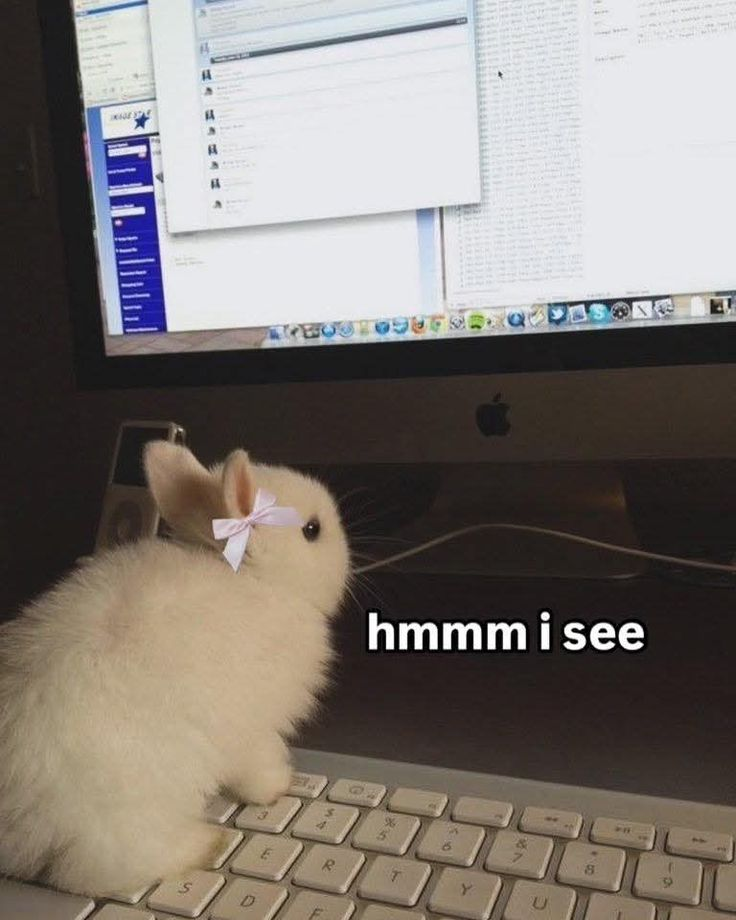

  

# Hello there, I'm Janika! 🌸

I've been coding for about 7 years now and have grown to enjoy all areas of software development! My main interests are in full-stack development and cybersecurity. Currently, I'm focused in expanding my portfolio and working on projects that allow me to bring out my creative side! ✨

<!--I spend **WAY** too much time listening to music, so i figured out why not give it a try and develop my own music streaming platform inspired by *Spotify*. It's still in its early stages, but I'm excited to see where it goes.

A fun fact about me is that I can name 150 countries on the top of my head (working on the rest!) and I am a proud plant mom to 4 plants! 🌱(who said compsci students dont touch grass? xd) --> 

 
  

# 💻 Tech Stack:
                    

# 📊 GitHub Stats:

  
  
  

### ✍️ Random Dev Quote

<!--### ✍️ Random Dev Quote

-->

<!-- ### 🔝 Top Contributed Repo -->

<!-- Proudly created with GPRM ( https://gprm.itsvg.in ) -->

<picture>
  <source media="(prefers-color-scheme: dark)" srcset="https://raw.githubusercontent.com/okiedokiejia/okiedokiejia/output/pacman-contribution-graph-dark.svg">
  <source media="(prefers-color-scheme: light)" srcset="https://raw.githubusercontent.com/okiedokiejia/okiedokiejia/output/pacman-contribution-graph.svg">
  
</picture>

###

<!-- 

  

-->

  

